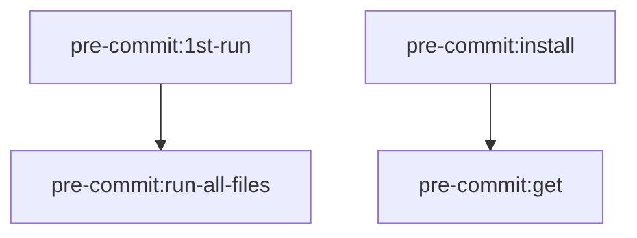

Pre-commit examples used in just-do-it repository

I really need a strict pre-commit considering the number of branches and tools i'm using.
Because the heart of the projects is tasks I want at the bare least `.pre-commit-config.yaml` to include the `task --list-all` command considering it compiles all the includes which may change name / location between branches.

so pre-commit-reset so designed to the bare minimum! by design in case you get stuck and i need to re-build it from scratch and on the fly..., it will only work if `RESET_PRECOMMIT` is not "true"

```yaml
# cat<<EOF>.pre-commit-config.yaml
repos:
  - repo: local
    hooks:
      - id: run-custom-script
        name: Run /usr/bin/env task --list-all
        entry: /usr/bin/env task --list-all
        # entry: ./posts/pre-commit/pre-commit.sh
        language: script
        pass_filenames: false
        stages: [commit]
      - repo: https://github.com/pre-commit/pre-commit-hooks
        rev: v3.4.0
        hooks:
        - id: check-yaml
            exclude: '^charts/helm-example/.*\.yaml$|^charts/common-helm-lib/.*/test-connection.yaml$'
        - id: check-executables-have-shebangs

```

## want to reset / rest after you tweaked with the template

```sh
RESET_PRECOMMIT="true" task pre-commit:1st-run
```

## Available Tasks

The following tasks are available for managing pre-commit hooks:


So a good place to start is the code which is available at [hagzag/just-do-it](https://github.com/hagzag/just-do-it/tree/main/config/tasks/suites/pre-commit)


### Core Tasks

- `pre-commit:1st-run` - Reset pre-commit configuration to bare minimal
- `pre-commit:gen-default-pre-commit-config` - Create the base configuration
- `pre-commit:get` - Install pre-commit via homebrew
- `pre-commit:install` - Configure pre-commit in local repo
- `pre-commit:run` - Run pre-commit on staged files
- `pre-commit:run-all-files` - Run pre-commit against all files

### Usage Examples

Reset/initialize pre-commit configuration:
```bash
RESET_PRECOMMIT="true" task pre-commit:1st-run
```

Run pre-commit checks on staged files:
```bash
task pre-commit:run
```

Install pre-commit for the first time:
```bash
task pre-commit:get pre-commit:install
```

### Task Dependencies


